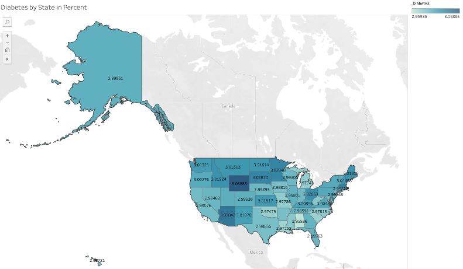
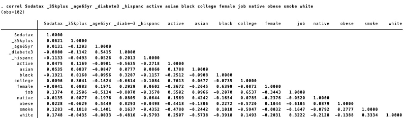
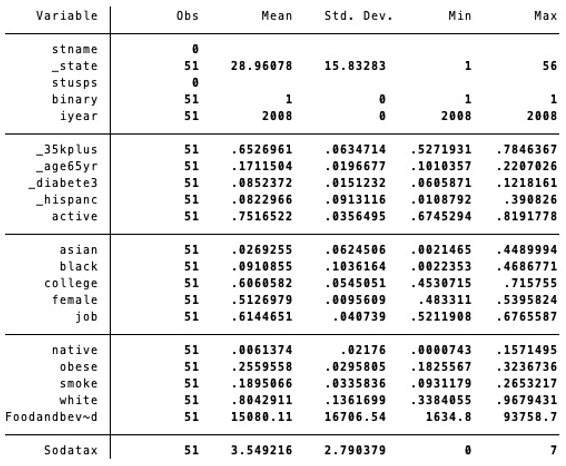
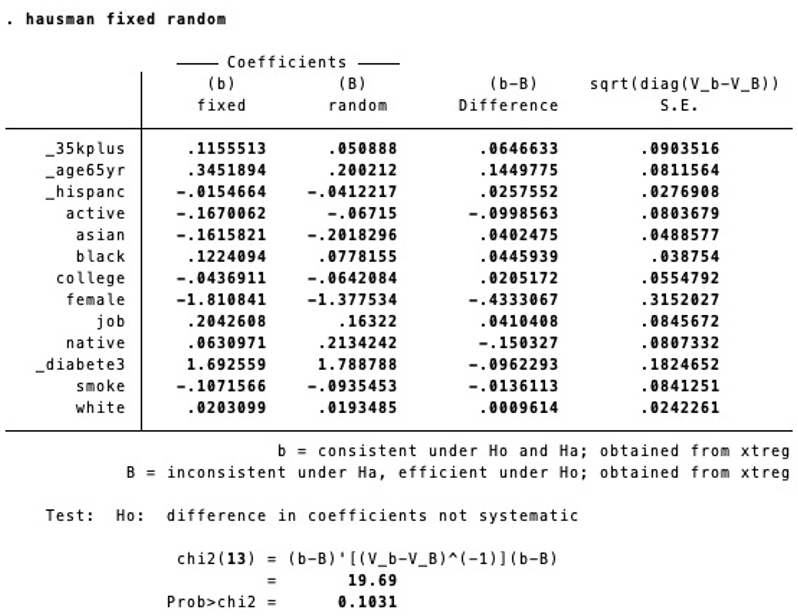
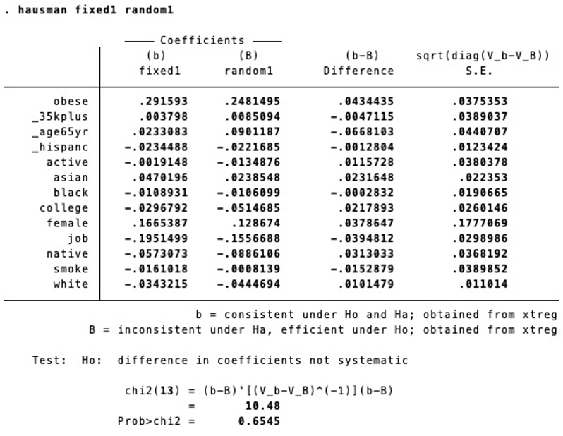

# Soda Tax and Public Health

<a href="https://bakeralexan.github.io/junk_food_and_public_health_econometric_analysis.github.io/">Here is the interactive website link</a>

This is an econometric analysis conducted with excel for data cleaning, stata for data analysis and visualization creation and tableau public for data vizualization creation.

## Executive summary
Given the national public health crisis in the US with soaring public health obesity cases, interventions aimed at influencing consumers to make healthy food choices have arisen. This can be done via price manipulation through taxes on unhealthy food and subsidies on healthy food. The implementation tests their efficacy in lessening preventable lifestyle diseases such as obesity and diabetes. This study used 2008 and 2018 data from the BRFSS survey by the CDC and ERS survey by the USDA, aggregated to the state level, to examine the impact of soda taxes on diabetes and obesity outcomes. OLS and panel data regressions were conducted. In this study, the soda taxes did not have any impact on the diabetes or obesity outcomes with coefficients close to zero and no statistical significance. The results of this study imply that a soda tax might not be a sufficient intervention to influence consumer choice in the US to limit unhealthy food choices and effect public health.

## Background
There are many studies that show that food prices have an impact on public health. In the case of obesity, the literature shows that while there are usually small impacts of food prices on weight, there can be larger impacts on people of lower socioeconomic status and people who are on the borderline of being overweight. [(Powell & Chaloupka, 2009)](https://www.ncbi.nlm.nih.gov/pmc/articles/PMC2879182/) That said, the impact of prices remains consistent and is statistically significant even when comparing lower-end versus higher-end grocery stores. The price of healthy and junk food matter more than the type of store. It also holds true for store distance. [Ghosh-Dastidar et al., 2014](https://www.ncbi.nlm.nih.gov/pmc/articles/PMC4205193/) The lowering in food prices for calorie-dense meals can increase body fat percentage even if body weight itself does not change much. [Lu & Goldman, 2010] (https://www.nber.org/system/files/working_papers/w15720/w15720.pdf) In the case of diabetes, there are not as many studies that examine the impact of prices. One study found that high prices of healthy food led to higher blood sugar, especially for low-income people; dairy was particularly associated with high blood sugar. [Anekwe & Rahkovsky, 2018] (https://ajph.aphapublications.org/doi/full/10.2105/AJPH.2013.301661r) Taxes on unhealthy food and subsidies on healthy food can even be effective in preventing deaths from diabetes, strokes, and coronary heart disease. [Penevalo et al., 2017] (https://link.springer.com/article/10.1186/s12916-017-0971-9) The impacts were more pronounced depending on the magnitude of the price change.

Although the most recent studies have looked at data from before 2017, this study hopes to provide an update on prior knowledge, with more recent 2018 data, to examine if the trends hold true for diabetes and obesity with food prices.

## Data Description

This study uses self-report data from the long running BRFSS study administered by the Center for Disease Control (CDC). It uses 1998, 2008, and 2018 data including the control variables for sex, income, education, employment, physical activity, race, and ethnicity. I have also repeated the regressions with diabetes and obesity as the dependent variables. The independent variable, food and beverages purchased for off-premises consumption in millions of dollars, comes from the United States Department of Agriculture's (USDA) long running ERS study. The USDA data comes at the state level whereas the BRFSS data had to be aggregated manually at the state level. 

### BRFSS Codebooks

The datasets themselves for BRFSS require too much data to download. Instead, here are the BRFSS Codebooks for this study: 
- [**1998**](https://www.cdc.gov/brfss/annual_data/1998/pdf/Codebook_98.pdf) 
- [**2008**](https://www.cdc.gov/brfss/annual_data/2008/pdf/codebook08.pdf) 
- [**2018**](https://www.cdc.gov/brfss/annual_data/2018/pdf/codebook18_llcp-v2-508.pdf)

### USDA Raw Data

Here is the data from the [***Quarterly Food-at-Home Price Database***](https://www.ers.usda.gov/data-products/quarterly-food-at-home-price-database/) from the USDA ERS.

### Cleaned Data
<a href="stata/BRFSSproportionsv2.smcl">Here is the cleaned data log output</a>

[***Here is the cleaned data log output***](https://github.com/bakeralexan/junk_food_and_public_health_econometric_analysis.github.io/stata/BRFSSproportionsv2.smcl)

<a href="stata/BRFSS_proportionsv2.do">Here is the cleaned data Do file</a>

[***Here is the cleaned data Do file***](https://github.com/bakeralexan/junk_food_and_public_health_econometric_analysis.github.io/stata/BRFSproportionsv2.do)

<a href="stata/BRFSS_proportionsv2.dta">Here is the cleaned data</a>

[***Here is the cleaned data***](https://github.com/bakeralexan/junk_food_and_public_health_econometric_analysis.github.io/stata/BRFSSproportionsv2.dta)
## Methodology
I first had to make all of my BRFSS variables categorical and binary. I then used the _svyset_ to set the appropriate weights and let STATA know that I was working with survey data. After that, I used _svy: proportion_ to make proportions of all of my variables from the BRFSS dataset to aggreggate them at the state level. I then exported my output to excel to use excel to combine the USDA and CDC datasets at the state level. I then ran _kdensity_, _histogram_, and _tabstat_ to generate descriptive data. Next, for my regressions, I used OLS and panel data random effects and fixed effects. Lastly I ran the _Hausman_ test.

## Results
Looking at the output for the simple linear regressions in figures 1 and 2, soda tax was not found to be a statistically significant predictor of diabetes or obesity. The same was true for the panel data regressions in figure 3. According to the correlations in figure 7, obesity and diabetes in the sample were strongly positively correlated at 0.829 on a scale of -1 to 1. Despite the strong positive relationship, the regressions have slightly opposing signs on their coefficients although close to 0. 

Interestingly, having an income of $35,000 or more had a slight positive relationship with the incidence of diabetes and obesity. That could be because the income cut off was too low to effectively examine people of low socioeconomic status versus those not. Its relationship is not strong enough to be statistically significant for 2008 or in the panel data regressions (see figures 1, 3,). The income variable was very statistically significant for the 2018 OLS regression, meaning it was significant at the 1% significance level (see figure 2).

Being above the age of 65 years old was statistically significant at the 1% significance level for diabetes in the year 2008 but not at all significant for the year 2018 or for either year for obesity for the OLS regressions. Its results were the inverse of the prior mentioned income variable. This is one of the most statistically significant predictor variables in the panel regression (see figure 3). It was statistically significant at the 1% level for the regular panel regression for diabetes and obesity, and the fixed effects regression for obesity. It was significant at the 5% level for the random effect regression for obesity. Considering that the correlation with both obesity and diabetes for age over 65 is over 0.54 for both, it makes sense that age would be a good predictor for these lifestyle diseases (see figure 7).

What is interesting for the Hispanic variable is that it has an inverse relationship with both diabetes and obesity. Asian also had that at the 1% significant level for the obesity OLS in 2008 and all of the obesity panel regressions. Having a high proportion of people who identify as Asian seem to be a strong predictor of lower obesity rates. That was not the case for diabetes. Conversely, people who identify as Black are statistically significant at the 5% level for obesity for the 2018 OLS and the panel data regression for fixed effects with a positive relationship. That mean a 1 unit increase in Black people is related to a 0.122 unit increase in obesity for the fixed effects regression. 

Much like the other variables, the coefficient for Native American or Indigenous had opposing signs for diabetes and obesity. It had a negative relationship with diabetes and a positive one with obesity. That means that higher proportions of Native Americans are associated with lower incidence of diabetes and higher incidence of obesity. These results are significant at the 5% level for the 2008 OLS for both obesity and diabetes and for obesity regular panel and random effect regressions. It is significant at the 1% level for the diabetes panel data except for the fixed effect.

As expected, having a college education or higher was associated with lower incidence of diabetes and obesity. This result was consistent with the literature. The relationship was statistically significant at the 5% significance level for the 2008 Diabetes OLS, meaning that for a 1 unit increase in college educated people, there was a 0.053 unit decrease in diabetes. Similarly, there was the same significance for this variable for the panel data random effects regression.
Although physical activity had a consistently negative relationship with both diabetes and obesity (see figures 1, 2, & 3), this variable had no statistical significance and the coefficient magnitudes were fairly small. Similarly, smoking did not have any visible trends except for its coefficients being negative for all of the panel data regressions. It did not have any statistical significance for any of the regressions.

One of the more surprising results was the strong relationship between female and obesity. Compared to diabetes that had a positive relationship, obesity had a negative one. At the 1% level were all of the obesity regressions except for the 2018 OLS, which was only significant at the 5% level. More than that, the coefficients are some of the largest in the sample. For a 1 unit increase in the proportion of females, there was a 1.3 to 1.8 unit decrease in the incidence of obesity. This result is consistent with current national data in which 43% of men were obese while only 41% women were. (NIDDK 2020)

Having a job was statistically significant at the 1% level with a negative relationship for almost all of the regressions for diabetes (see figures 1, 2, & 3). The coefficients for this variable were also somewhat bigger in magnitude than the other variables but not to the point of female variable.
The Hausman Test (see figures 11 & 12) failed to reject the null hypothesis when comparing the results from the fixed effects regressions and the random effects regressions for both diabetes and obesity. Based on those results, it is better to look at the results from the random effects regression rather than the fixed effects regressions because it would be more reliable.

I failed to reject the Hausman test for either diabetes (**0.9102**) or obesity ( **0.0935**), as such the random effects can be fine to use.
### Discussion
In this study, the soda taxes did not have any impact on the diabetes or obesity outcomes with coefficients close to zero and no statistical significance. Conversely, other variables had stronger predictive powers such as having a job leading to a lessening of diabetes incidence and the same for being female with obesity. Since the primary focus of this study was the soda tax, the findings of this study did not support junk food taxes as an effective intervention. The results mirror what other studies said about it not having enough impact on its own. Also, this type of intervention uses regressive taxation that limits the purchasing power of US constituents, especially those of lower socioeconomic status. If the public health impacts do not improve, it might not be worth it to limit the public in such a way because of the risk of adverse effects like increased food insecurity. That said, the scope of this study was not enough to make any conclusive statements on the issue.

One of the limitations of this study was the small sample size, the OLS regressions only had 51 observations per year and with the combined years in the panel data, it only aggregated to 102 observations. In the future it would be beneficial to attempt this study at the county level although it might be difficult to get BRFSS county level data. Similarly, it would be good to expand the range of years. Initially, this study had chosen to focus on food prices rather than a food price-related intervention. However, there was not such available data at the state level. It would be interesting to see that type of study. Similarly, it would be good to get a more thorough update with more available years of data to compare. There can be a focus on other types of junk food taxes as well. Finally, there was not as much data supporting the efficacy of healthy food subsidies so an inverse of this study would be an interesting direction.

### Visualizations

##### Race and Ethnicity by Year

<a href="https://public.tableau.com/profile/alexandra.baker#!/vizhome/DiabetesbyStateinPercent/Diabetes?publish=yes">Figure 5 Diabetes By State Interactive Graphic Link</a> 

<a href="https://public.tableau.com/profile/alexandra.baker#!/vizhome/ObesitybyStateinPercent/Obesity?publish=yes">Figure 6 Obesity By State Interactive Graphic Link</a>

<a href="https://public.tableau.com/views/FoodandBeveragesPurchasedbyStateinMillionsofDollars/FoodandBeverage?:language=en&:display_count=y&publish=yes&:origin=viz_share_link">Food and Beverages Interactive Graphic Link</a> 

### Regressions
Consolidated Diabetes Regression Table

Consolidated Obesity Regression Table

### Appendix
##### Figure 1

#####  Figure 2

##### Figure 3

##### Figure 7

##### Figure 9

##### Figure 10

##### Figure 11

##### Figure 12

